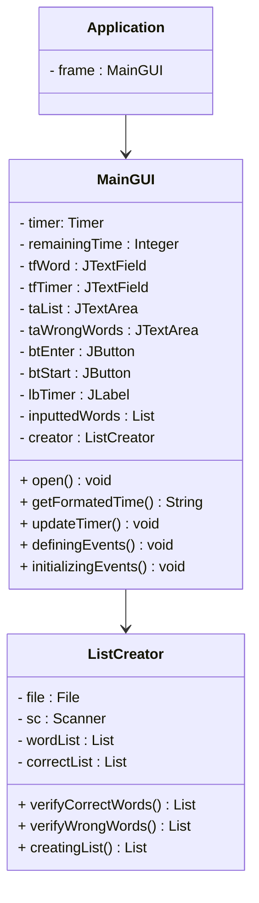

# pooGame

```mermaid
classDiagram
    class Application{
        - frame : MainGUI
    }

    class MainGUI{
        - timer: Timer
        - remainingTime : Integer
        - tfWord : JTextField
        - tfTimer : JTextField
        - taList : JTextArea
        - taWrongWords : JTextArea
        - btEnter : JButton
        - btStart : JButton
        - lbTimer : JLabel 
        - inputtedWords : List
        - creator : ListCreator

        + open() void
        + getFormatedTime() String
        + updateTimer() void
        + definingEvents() void
        + initializingEvents() void
    }

    class ListCreator{
        - file : File
        - sc : Scanner
        - wordList : List
        - correctList : List

        + verifyCorrectWords() List
        + verifyWrongWords() List
        + creatingList() List
    }

    MainGUI --> ListCreator
    Application --> MainGUI
```
